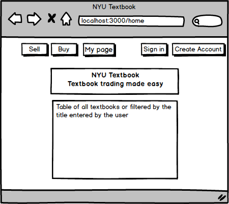
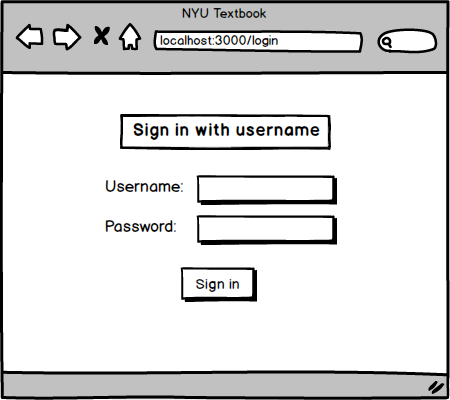
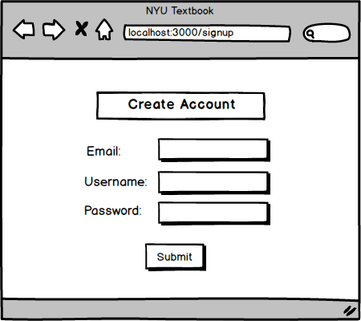
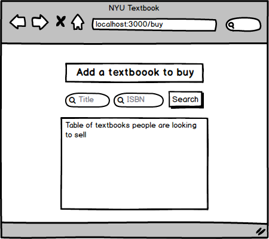
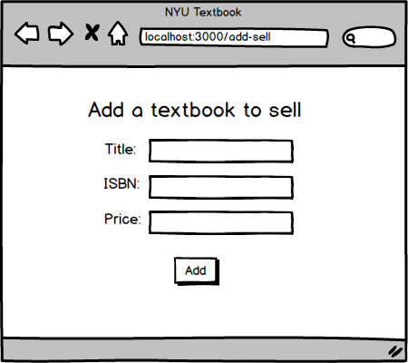
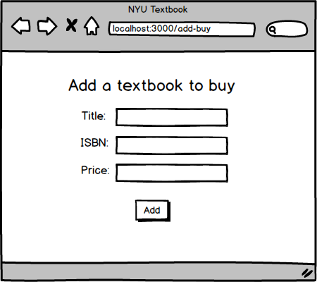
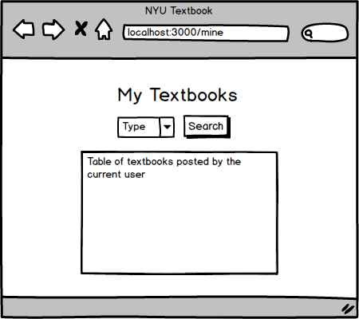
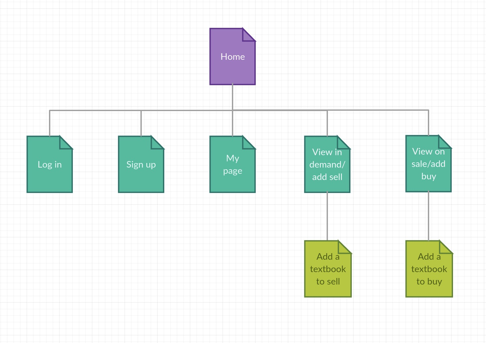

# NYU Textbook

## Overview

Have you ever felt that textbooks put an extra burden on you? New textbooks can often be pricey, and given the number of textbooks required for each semester, getting used or rental textbooks from bookstores will not make things easier. And as the semester comes to an end, the new problem of how to get rid of the textbooks you no longer need arises. You sure can sell them back, but bookstores might only pay you $1 for a textbook that cost you $15, and then sell it to some other student for a much higher price. So, is there a better way to deal with textbooks? With NYU Textbook, the answer is yes!

NYU Textbook is a web application that will allow users to sell textbooks they no longer need and buy textbooks they are looking for. All transactions will happen directly between NYU students with no middle man involved. Once users are logged in, they can post information about the textbook they are looking to sell, as well as the textbook they are looking to buy. They can also search for a textbook based on the title or the ISBN of the book.

## Data Model

The application will store Users and Textbooks
* users can have a list of textbooks they would like to sell and a list of textbooks they would like to buy


A Sample User:

```javascript
{
  username: "sampleuser",
  email: 'user@gmail.com',
  hash: // a password hash,
  salt: // randomly generated salt,
  textbooks: // an array of references to Textbook documents
}
```

A Sample Textbook:

```javascript
{
  user: // a reference to a User object,
  contact: // email of the user,
  action: // sell or buy,
  title: "booktitle",
  isbn: // 10-digit  or 13-digit ISBN,
  price: // price for sale or willing to pay
}
```

## [Link to Schema](db.js) 


## Wireframes

/home - page for choosing to buy or sell a textbook, log in or create a new account



/login - page for logging in 



/signup - page for creating a new account



/sell - page for viewing all textbooks people are looking to buy, search a textbook, or go to the page to add a textbook to sell


/buy - page for viewing all textbooks people are looking to sell, search a textbook, or go to the page to add a textbook to buy



/add-sell - page for adding a textbook to sell



/add-buy - page for adding a textbook to buy



/mine - page for showing all textbooks the user added



## Site map



## User Stories or Use Cases

1. As a new user, I can create an account with the site.
2. As a user, I can log in with my username and password.
3. As a user, I can view the list of all the textbooks on sale.
4. As a user, I can view the list of all the textbooks people are looking to buy.
5. As a user, I can add a textbook I am looking to sell.
6. As a user, I can add a textbook I am looking to buy.
7. As a user, I can view the list of textbooks added by me.

## Research Topics

* Unit testing with JavaScript
	* I will be using Mocha for unit testing
	* I will use unit tests to check if the functions I created are working properly, e.g. the function to validate ISBN
* Automated functional testing
	* I will be using Selenium to test my routes
	* I decided to use Selenium because I have experience with it for web scraping, but not for automated testing
	* I will be using Google Chrome as the browser to perform the tests
	* I will be using Python as the language to write the tests
* Client side form validation
	* I will be using Parsley.js to perform form validation
	* Form validation will be performed when user enters username, password, email address, ISBN, etc.
* Bootstrap
	* I will be using Bootstrap as the CSS framework of my site
	* I will add customization to the framework used
* bcrypt.js
    * I will be using bcrypt.js to perform password encryption
    * I will be using bcrypt.js to generate a salt for each user, and then save the salt and the password hash in the User schema in the database
    * I will be using a combination of bcrypt.js and session to achieve user authentication


## [Link to Main Project File](app.js) 

## Annotations / References Used

1. [bcryptjs  -  npm](https://www.npmjs.com/package/bcryptjs)
2. [Mocha - the fun, simple, flexible JavaScript test framework](https://mochajs.org/)
3. [Selenium Documentation](https://www.seleniumhq.org/docs/)
4. [Parsley - The ultimate documentation](https://parsleyjs.org/doc/)
5. [Introduction · Bootstrap](https://getbootstrap.com/docs/4.3/getting-started/introduction/)